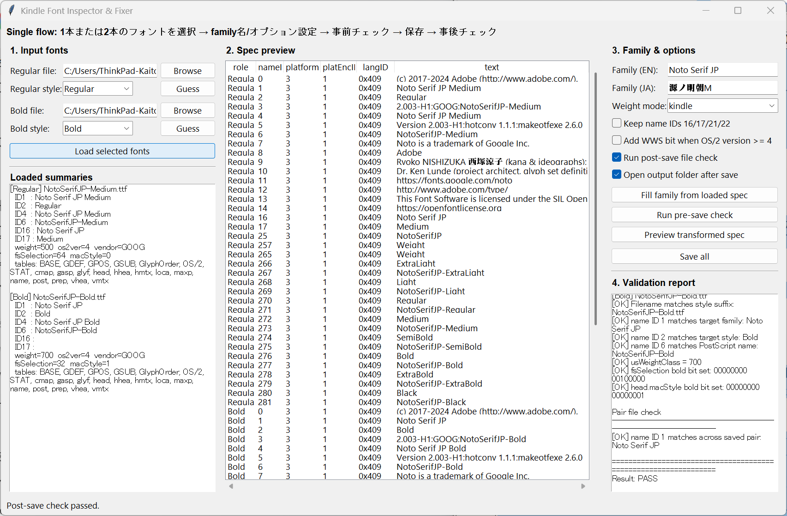

# Kindle Font Inspector & Fixer



Kindle 向けカスタムフォントの `name` テーブル、`OS/2`、`head` を確認・修正し、保存前後に整合性チェックできる GUI ツールです。

## Features

- 1本または2本のフォントを読み込み
- Family 名とスタイルの再設定
- Kindle 向けの `Regular` / `Bold` 命名に寄せた保存
- 保存前チェック（family 名、style 重複、出力名衝突など）
- 保存後チェック（保存済みファイルを再読込して `name ID 1/2/6`、`OS/2`、`head` を検証）
- Regular / Bold ペアの簡易検証

## Requirements

- Python 3.10+
- `fonttools`
- Tkinter

## Install

```bash
git clone https://github.com/SpaceRunner-K/kindle-font-gui.git
cd kindle-font-gui
pip install -r requirements.txt
```

Tkinter は Python に標準で付属していますが、Linux 環境などでは別途 `python3-tk` などの導入が必要な場合があります。

## Usage

```bash
python kindle_font_gui.py
```

### Basic flow

1. `Regular` と必要に応じて `Bold` のフォントを選択
2. `Load selected fonts` を実行
3. `Family (EN)` と必要なら `Family (JA)` を設定
4. `Weight mode` や各種オプションを設定
5. `Run pre-save check` で保存前確認
6. `Save all` で出力
7. `Run post-save file check` が有効なら保存後検証を確認

## Output filename spec

### 命名形式

出力ファイル名は以下の形式で生成されます。

```
{PostScript化したFamily名}-{style}.{ext}
```

| 内容 | 条件 |
|---|---|
| `Family名` | `Family (EN)` 欄に入力した文字列 |
| PostScript 化 | スペースを除去し、ASCII 範囲外文字および不正記号を除去した後の文字列 |
| `style` | 各ロールで設定したスタイル（`Regular` / `Bold`） |
| `ext` | 入力ファイルの拡張子（`.otf` または `.ttf`）を指継 |

**例:**

```
Family (EN): My Mincho
→ MyMincho-Regular.otf
   MyMincho-Bold.otf
```

### 上書きの挙動

- **上書き確認ダイアログは出ません。** 同名ファイルが展開先フォルダに存在する場合、無へんに上書きされます。
- 上書きを防ぎたい場合は、**毎回空のフォルダを選択**するか、事前にファイルを除去してください。
- `Save all` 実行前に出力名の衝突は「保存前チェック」の段階で検知できますが、それは「**2本の出力同士が衝突しているか」**のチェックであり、既存ファイルとの衝突は検知しません。

### 入力ファイルは変更されません

入力元フォントは一切変更されぺ、常に別名で新規保存されます。同じフォルダに元ファイルと同名のファイルが生成される場合は上書きになりますが、これは入力ファイルを直接上書きしているわけではありません。

## Validation policy

### Pre-save check

- Family 名が空でないか
- PostScript 名のベースが極端に短くないか
- 2本構成で style 割り当てが重複していないか
- 出力予定ファイル名が衝突していないか
- typographic IDs を保持する設定なのに、元データ側に必要項目が見当たらないか

### Post-save check

保存後に出力ファイルを再度開いて、以下を検証します。

- ファイル名の suffix
- `name ID 1`
- `name ID 2`
- `name ID 6`
- `usWeightClass`
- `fsSelection`
- `head.macStyle`
- 2本出力時の family 一致

## Notes

- Kindle 側の解釈は端末やファームウェア差の影響を受ける可能性があります。
- このツールの保存後チェックは、Kindle 実機での最終挙動を完全保証するものではなく、静的整合性チェックです。
- 元フォントのライセンスを確認したうえで利用してください。

## Recommended repository structure

```text
.
├── kindle_font_gui.py
├── README.md
├── LICENSE
└── docs/
    └── screenshot.png
```

## Roadmap

- 結果表示の色分け強化
- 事前チェックのルール拡充
- 出力レポートの保存
- ドラッグ＆ドロップ対応

## License

MIT License
